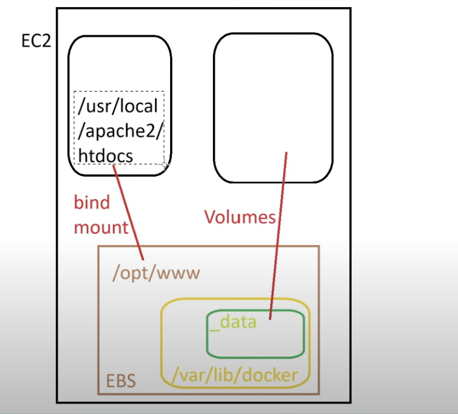

What is the use of Docker and problems addressed by the Docker
    Problem statement :
        Lets say we are working in a porject where we need to support a client who has 3 apps is running in various machines like(Windows, Linux, Ubuntu)
        so we have 3 different machines we have. 

        1) Cost:  lets say I create Ec2 istance for each machine and run the apps 
                one machine cost approx 100$ so totally I need to spend 300$
        2) lets say I buy a huge hardware and install hypervisor and split the configuration equally to run each application. But os itself will consume 20-30% storage and CPU ram is comsumed
        3)  Library and dependencies problem. when we run many apps in single machine, we need to install libraries and dependencies for each apps. 

Refer the images Before_docker and docker. 

How to overcome the above prblem statement:
    1) Install Docker :D
    2) Kernal Sharing will happen once Docker is installed. 
            Let's take the above exaplme, instead of running 3 different Ec2 instance for each apps of linux , now I will Run 1 ec2 linux instance and install Docker. 
                Now docker will use the same kernel and run the other two different linux instances by downloading the image. 

Docker hub link 

Port Mapping : -p hostport:containerport
    We need to publish the port. it means we need to tell docker to create container and link the host port (ex 9123) to container port(80). 
    so to access the contents in the httpd container we need to connect it through this port. 

        

Docker online editor:
    docker playground. 
    before this we need to isntall docker hub.
    here we can run the docker commands in that instances

Docker commands:
    1) docker images 
    2) docker pull <imagename> -> docker pull httpd
    3) docker ps  
    4) docker ps -a 
    5) docker run -itd -p 9123:80 httpd
    6) docker run -itd --name "webserver2" -p 8000:80 httpd
    7) docker stop <contianer name>
    8) docker rm <contianer name>
    9) docker rm -f <contianer name>
    10) docker rmi <imagename>
    11) docker exec -it <containerid> /bin/bash -> to login to the container and go to /bin/bash location
    12) docker top <containerid>
    13) docker inspect <containerid>
    14) docker commit <continaer ID> myimage:v1
    15) docker save -o ./myimage_backup.tar myimage:v1
    16) docker load -i myimage_backup.tar
    17) docker tag myimage:v1 <dockerusername/mynewimage:v1>
    18) docker push moradocker/mynewimage:v1
    19) docker build -t "Myimage" <DockerfileLocation>

Dockerfile commands:
    1) FROM <image name> -> base image
    2) LABEL <Name = "Praveen"> -> its like giving metadata info, just like givgin tags to the EC@ container.
    3) WORKDIR </app> -> instructing docker to move to this dir and run the below, we can give any number of times in the file, it is just like giving cd in linux. 
    4) COPY <src> <dest> -> src = host, dest = IMAGE
    5) RUN <cmds> -> run some commands 
    6) ENTRYPOINT <python3 main.py> -> to give some initalization commands or start-up commands. 
    7) ADD <src=file, URL, TAR> <dest>
    8) CMD <it is just like ENTRYPOINT, but Executed after ENTRYPOINT(if it is there), it hold the default value, it can be overridden in the docker run command, which means we can modify the startup commands.>
    9) EXPOSE <port number> 
    10) ENV -> it is otherwise called runtime argument -> this is used during "docker run" command
    11) ARG -> it is otherwise called build time argument-> this is used during "docker Build" command.
    
other commands :
    1) cat /etc/os-release -> this will tell which favour of linux. 

Interview Questions: 
    NOTE: FOR QUESTION 1 AND 2 REFER THE IMAGE ATTACHED BEFORE 3 QUESTION. 
    1) Can I create a image from an running containers? Yes, COMMIT command will convert the container into a image. 
        docker commit <continaer ID> myimage:v1
    2) how to share this image to the team -> there are two methods, 
        - i) without internet(steps to follow)
                - SAVE command will convert the image into tar file which can be shared. 
                     docker save -o ./myimage_backup.tar myimage:v1
                - SCP command transfer tar file from one linux machine to another without internet connection
                - LOAD will create image from this TAR file. 
                    docker load -i myimage_backup.tar   -> this will create a new image
                
         ii) with internet. 
                - First tag the image 
                    docker tag myimage:v1 <dockerusername/mynewimage:v1>
                    docker tag myimage:v1 moradocker/mynewimage:v1
                - docker login
                - docker push moradocker/mynewimage:v1

                
    3) Explain docker arch -> https://sysdig.com/learn-cloud-native/what-is-docker-architecture/  (Client(docker commands), Docker_host(docker-deamon), Registry)
    4) Docker Lifecycle or docker container lifecycle both are same.  refer this image -> https://www.linkedin.com/pulse/understanding-docker-container-lifecycle-depth-rohit-kumar-shaw/
    5) what is the difference between pause and stop the containers? -> Always to run a container docker will use some CPU and memory. so when you pause the contianer, it will hold the CPU and memory and use it when you unpause it. 
        But when we stop the container the CPU and memory allocated will be closed and when we start the container again it will use new CPU and memory so it take some time. 
    6) what is ephermal? how you manage the data stored in the container? In general ephermal meaning it is lasting or live in short period of time. so continaers are ephermal.  it will be stopped, deleted or recreated. so we lose the content. So we use Volume. 
    7) What are the types of volumes -> REFER THE IMAGES ATTACHED. 
            i) Bind Mount: mounting any path of the filesystem from host machine to container path 
                ex: -v /opt/www/:/usr/local/apache2/htdocs
            ii) Vloume Mount: This is similar to bind mount, instead of giving any path in filesystem we need to give the docker volume path itself. /var/lib/docker/volumnes/my-vol(we have to create a folder)
                ex --mount source=my-vol<host>, target=/usr/local/apache2/htdocs<we can give any path from container>
            iii) tmpfs Mount:  The data stored in this location will be deleted if the container is deleted. Then what is the use of it.
                 Lets says the container is creating a huge logs, instead of storing that huge logs inside the container we can store them outside the container, so it won't affect the performace of the container. 

                 

                 
    8) -d -> why you are giving d parameter in the docker run command. 
            -d means detached mode. it means run the container in the background. 
            if we don't give this it will run in foreground it means we will be logged into the container and we see the tail-logs running. 
        -i -> interactive mode : if I not give this, I can Login to the container but I cannot run any commands it means i cannot interact with the container. 

        ENTRYPOINT  : It is used to tell docker to run this command once the container is created. we can give only one ENTRYPOINT.  Commands in the ENTRY  POINT will run only whne the container is launched. 

        -t terminal : to specific which terminal we need to connect. /bin/bash or sh or python3

    9) How to keep your dokcer image small? three ways we can keep it small.
        1) I use alpine edition or busybox as my base image. the size of the image will be very small (within 10MB max)Generally other images will be like 80MB or 100MB. bcoz it doesn't have unwanted packages. on top of that I install the packages which is required for me overall it will be lesser when I compared to other images. 
        2) Use multistage docker file. Split the big docker file with two or more FROM command. refer the image
            Before Mutistage: 
            
            After Mutistage : 
        3) Use .dockerignore (inside this we can keep things which is required but not to push it in the image.)
    10) diff between COPY and ADD
        COPY -> old command
        it can only copy the files from src to destination(Image)

        ADD -> new command
            it can copy 
                - files from src to destination just like COPY command and additionally it can do below, 
                - URL -> we can give link(URL) it will (wget)download the content and copy into the image
                - tar -> we can give tar file, it will extract the content and copy them into as seperate file in the image. 
    11) Incase I need to copy the tar file and paste as tar file in the image which command you use?
            Ans: I use COPY command.
    12) Difference between CMD and ENTRYPOINT 

                                ENTRYPOINT               CMD
        1) Start-up commands    Yes                      Yes
        2) Only once            Yes                      No(We can have multiple, but only the last CMD will be used)
        3) Overidden            NO                       Yes

        It is just like ENTRYPOINT, but Executed after ENTRYPOINT(if it is there), it hold the default value, it can be overridden in the docker run command, which means we can modify the startup commands.>

         for reference.

    13) write sample docker file:
        check the sample docker file
    14) difference between ENV and ARG command in docker file. 
        ENV - it is runtime argument, passed during "docker run" command and can be overriden during runtime
        ARG - it is Build argument, passed during "docker build" command and can be overriden during build
        

    